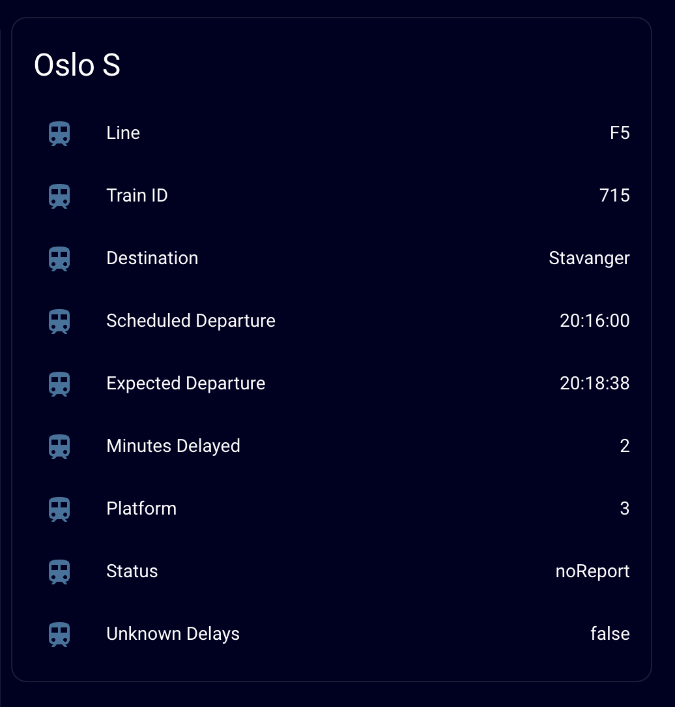

# Bane NOR - Home Assistant



Bane NOR train departure times in Home Assistant using the official API and RESTful sensor.

## Official API documentation

To get the required information to create the sensor in Home Assistant you may need to consult the official API documentation available at https://www.banenor.no/apne-data-fa-togtidene-gratis-pa-nett-og-skjermer/ Contains data under the Norwegian license for Open Government data (NLOD) distributed by Norwegian National Railway Administration.

Download and extract The official API documentation `last-ned-lisenser-og-kokumentasjon.zip` you will find the following files:

- `Stationlist passengers.txt` file with a list of all stops you can use with the API
- `Introduction to SIRI - v2.pdf` file with the API documentation itself
- `Introdution to RTD - v2.pdf` file with the documentation for Real Time Display (use with Digital Signage, etc)
- `NLOD - SIRI (no).pdf` Licence (in Norwegian) Norwegian License for Open Government Data (NLOD) – Bane NOR
- `NLOD - SIRI (en).pdf` Licence (in English) Norwegian License for Open Government Data (NLOD) – Bane NOR

## Find the correct query for the desired departures for your stop

The RESTful sensor uses the SIRI Stop Monitoring Service of the API.

In the `Stationlist passengers.txt` file you will find a list of all stations. Find the station corresponding to the station you want in Home Assistant.

Send a GET request to https://siri.banenor.no/jbv/sm/stop-monitoring.xml?MonitoringRef=XXX where `XXX` is the station e.g. `OSL`. You may also apply any filters here, see the official API documentation for details.

If you want to filter by multiple `DirectionRef` e.g. trains going to Kristiansand `KRS` or Stavanger `STV` loop through each `MonitoredStopVisit` in `value_json.Siri.ServiceDelivery.StopMonitoringDelivery.MonitoredStopVisit` and extract the desired departures (you cannot do this directly in the query).

```YAML
value_template: >
  
    
      {{ MonitoredStopVisit.MonitoredVehicleJourney.XXX }}
      
    
  
```

## XML file structure

You will get an XML file with the following data, this section is from the official API documentation available at https://www.banenor.no/apne-data-fa-togtidene-gratis-pa-nett-og-skjermer/ Contains data under the Norwegian license for Open Government data (NLOD) distributed by Norwegian National Railway Administration.

`MonitoredVehicleJourney`

Each `MonitoredStopVisit` has a `MonitoredVehicleJourney` element which associates the `MonitoredStopVisit` with the MonitoredVehicleJourney being made by the Vehicle arriving at the stop.

- `LineRef` - Reference to a Line
- `DirectionRef` - Reference to a Direction the Vehicle is running along the Line. Eg. to Oslo or from Oslo.
- `FramedVehicleJourneyRef` - A reference to the dated vehicle journey that the vehicle is making. Unique within the
- `data horizon.
- `VehicleMode` - Possible values: air, bus, coach, ferry, metro, rail, tram, underground
- `PublishedLineName` - Name or Number by which the Line is known to the public.
- `DirectionName` - Name of the relative direction the Vehicle is running along` - to Oslo or from Oslo.
- `ProductCategoryRef` - The product in short form e.g. "Lx"
- `ServiceFeatureRef` - classification of service (e.g. "passengerTrain")
- `OriginName` - Name of the origin of the vehicle.
- `PredictionInaccurate` - Boolean flag set to true if the vehicle is standing still unexpectedly or sth else happend - which made it impossible to provide an accurate prediction
- `DestinationName` - Name of the destination of the vehicle.
- `VehicleRef` - Id of the vehicle (also known as "train id")
- `OperatorRef` - code for the operator of this journey.
- `Via` - Zero or more elements of this name indicate the list of via stations which will be passed by the journey on it's upcoming route
    - `PlaceRef` - Reference to a station name
    - `PlaceName` - Name of the station passed by the journey

`MonitoredCall Element`

The `MonitoredCall` is the stop requested in the request `MonitoringRef` (Logical Display)

- `VehicleAtStop` - Boolean flag which indicates whether the vehicle is at the stop or not.
- `AimedArrivalTime` - Arrival time of the Vehicle in either the original or Production Timetable.
- `ExpectedArrivalTime` - Estimated time of arrival.
- `ActualArrivalTime` - Observed time of arrival.
- `ArrivalPlatformName` - Platform this vehicle is arriving at.
- `ArrivalBoardingActivity` - Activities allowed for arriving passengers. Possible values: alighting, noAlighting, passthru
- `AimedDepartureTime` - see arrival
- `ExpectedDepartureTime` - see arrival
- `ActualDepartureTime` - Observed time of departure.
- `DeparturePlatformName` - see arrival
- `DepartureBoardingActivity` - Activities allowed for departing passengers. Possible values: boarding, noBoarding, passthru
- `StopsAtAirport (Extension)` - true if an airport is on the remaining sequence of calls
- `ArrivalStatus / DepartureStatus` - onTime, delayed, arrived, departed. Business Rules already applied - eg. Delays of less than 3 minutes are not reported as delays.

## 3 Use this URL with the RESTful sensor in Home Assistant

See [configuration.yaml](configuration.yaml) for example config. The example gives information about the next departure.

`sensor`

- `banenor_oslos_line` Line number `PublishedLineName` from API
- `banenor_oslos_trainid` Train ID `VehicleRef` from API
- `banenor_oslos_destination` Destination of train `DestinationName` from API
- `banenor_oslos_scheduled_departure_raw` Scheduled departure in ISO 8601 format `AimedDepartureTime` from API
- `banenor_oslos_departure_raw` Expected departure in ISO 8601 format `ExpectedDepartureTime` from API
- `banenor_oslos_scheduled_departure` Scheduled departure in format %H:%M:%S `AimedDepartureTime` from API
- `banenor_oslos_departure` Expected departure in format %H:%M:%S `ExpectedDepartureTime` from API
- `banenor_oslos_delays` Number of minutes delayed (difference between `AimedDepartureTime` and `ExpectedDepartureTime` from API)
- `banenor_oslos_platform` Platform `DeparturePlatformName` from API
- `banenor_oslos_status` Status of the train e.g. Cancelled `DepartureStatus` from API
- `banenor_oslos_delays_unknown` If unknown delays `true` (otherwise `false`) `PredictionInaccurate` from API

## 4 Dashboard

After restarting Home Assistant you can create a dashboard with the desired entities. Here is an [example dashboard](dashboard.png) with corresponding [YAML code](dashboard_card.yml).
